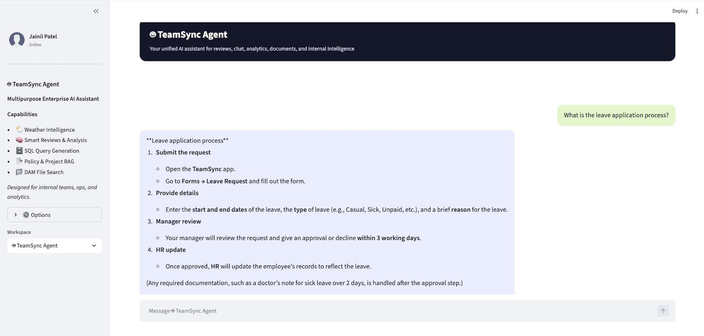
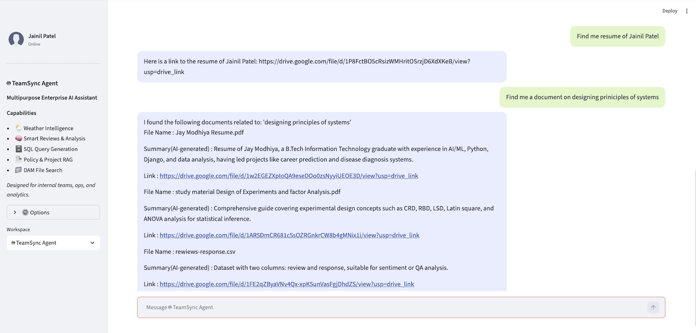
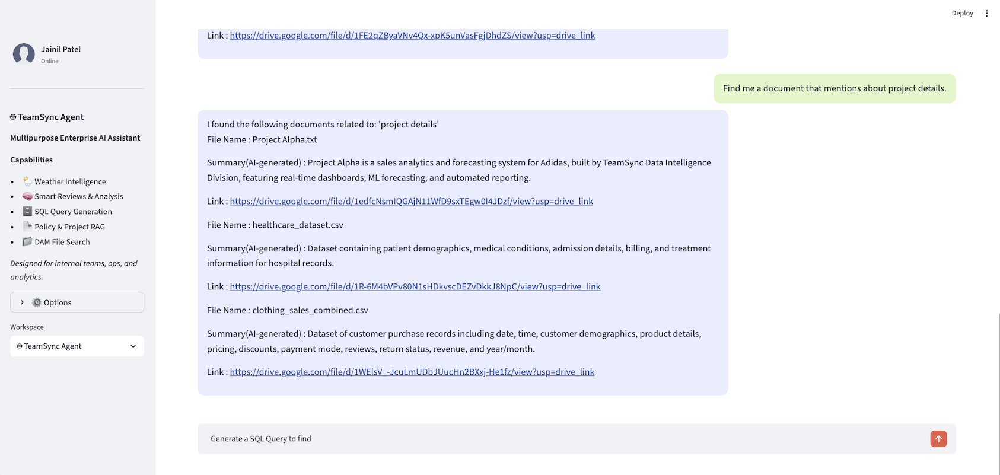
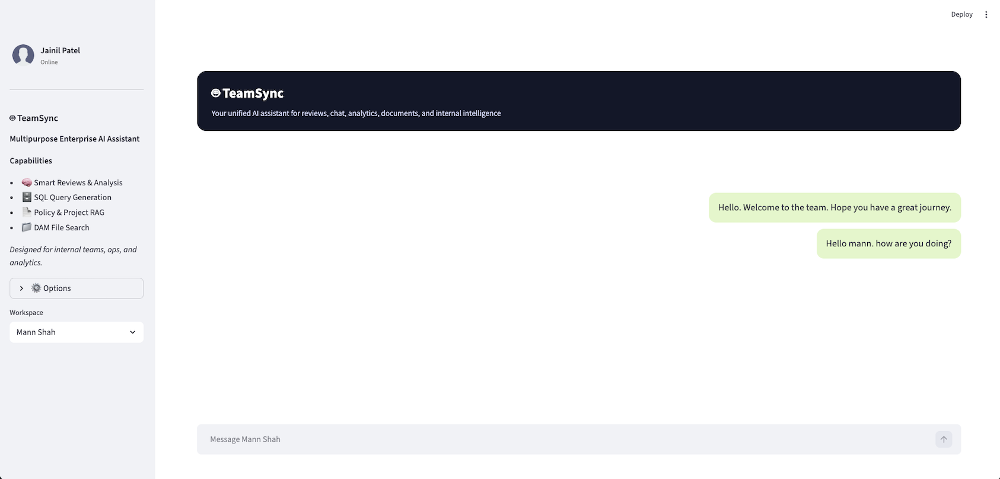
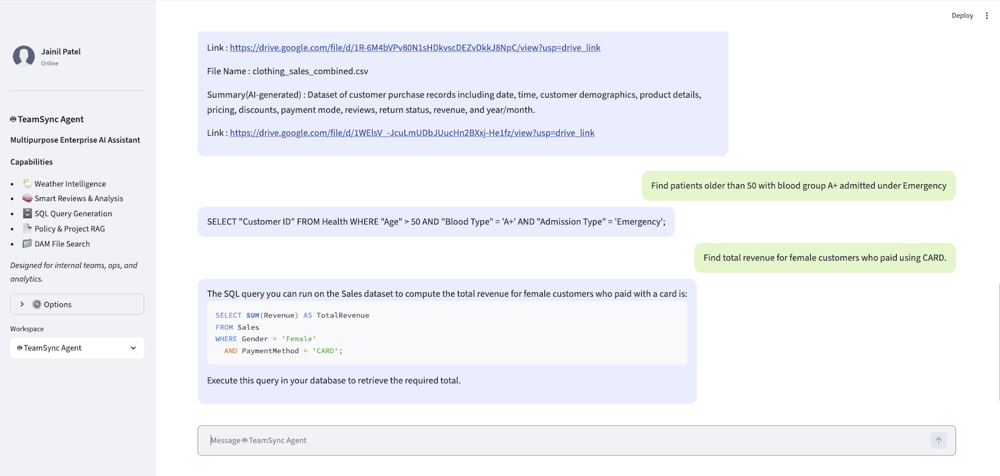
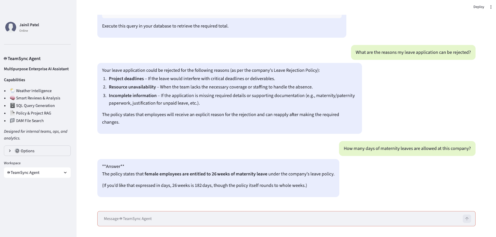
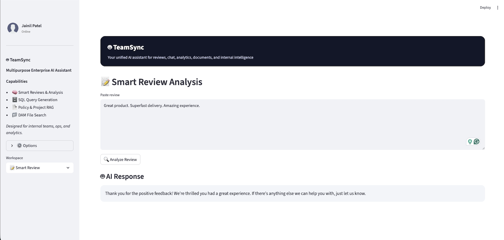
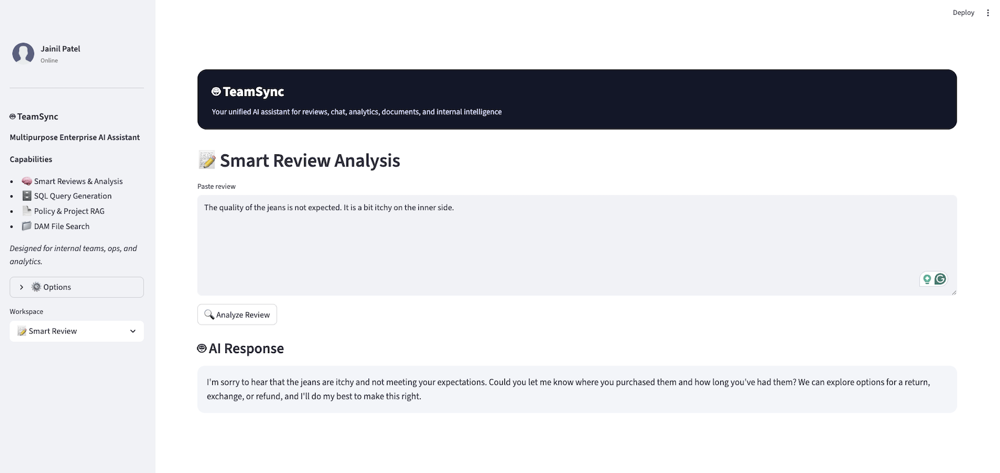

# 🤝 TeamSync – AI-Powered Team Collaboration Platform

**TeamSync** is an all-in-one AI-driven collaboration and productivity platform designed to enhance how teams communicate, recruit, analyze, and manage knowledge — securely and intelligently. It automates everyday workflows such as interviews, meetings, messaging, and analytics — all while maintaining enterprise-level data privacy. It’s built to empower organizations with intelligent insights, seamless communication, and secure data management.

---

## 🧩 Core Features

<!-- ### 🎙️ AI Interview
- Conduct fully automated interviews with real-time **speech-to-text**, **sentiment**, and **response evaluation**.
- Generate instant candidate summaries and performance metrics. -->

### 📂 Smart Asset & Knowledge Manager
- Centralized AI-driven repository for company files and documents.
- Supports **semantic search** for convinient file search and **content tagging** using NLP.
- Quick retrieval of meeting notes, project files, and knowledge resources.

### 🧑💼 HR Bot
- Acts as a virtual HR assistant for:
  - HR FAQs automation chatbot for reducing overall load of HR team.
  - Uses RAG for answering from the existing knowledge base of project details, leave policies, etc.

### 📊 AI Sales & Data Analyst
- Provides **real-time insights** into sales, performance, and revenue trends.
<!-- - Uses ML for **forecasting and anomaly detection**. -->
- Auto-generates interactive analytics dashboards.

### 📞 Smart Meetings (Audio & Video)
- Transcribe audio and video files of meetings:
  - **Automatic transcription**
  - **Meeting summarization**
  - **Action-item and decision extraction**

### 💬 Smart Texting & Chat Analysis
- Detects events in the text and set reminders automatically.

### 💬 Automated Review Responder
- Responds to reviews automatically.
<!-- - Provides **team sentiment dashboards** and **productivity trends**.
- Summarizes long conversations and highlights key action points. -->

### ⚙️ Security with Private Database
- End-to-end encrypted communication.
- Data stored in **private, isolated databases**.
<!-- - Role-based access control (RBAC) for teams and admins. -->

---

## Application Screenshots

### 1. HR Bot

### 2. HR Bot

### 3. HR Bot

### 4. HR Bot

### 5. HR Bot

### 6. HR Bot

### 7. HR Bot

### 8. HR Bot

